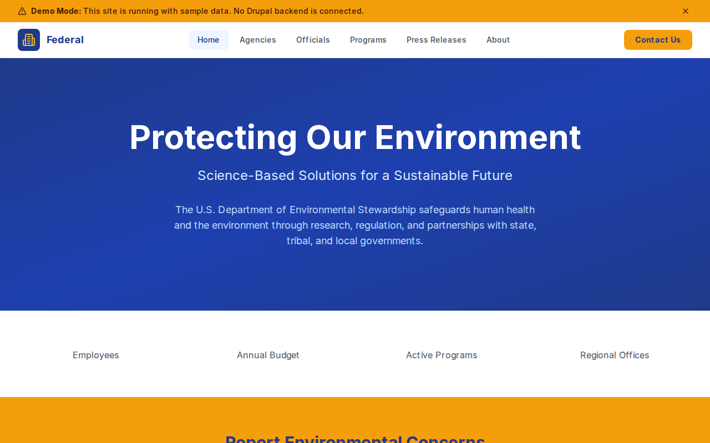

# Decoupled Federal

A federal government agency website starter template for Decoupled Drupal + Next.js. Built for federal departments, agencies, bureaus, and government organizations.



## Features

- **Agency Divisions** - Showcase bureaus, offices, and centers with leadership and contact information
- **Agency Officials** - Directory of senior officials and appointed leaders with bios and responsibilities
- **Federal Programs** - Present grants, research initiatives, and community development programs with eligibility and deadlines
- **Press Releases** - Publish official statements, enforcement actions, and regulatory announcements
- **Modern Design** - Clean, accessible UI optimized for government content

## Quick Start

### 1. Clone the template

```bash
npx degit nextagencyio/decoupled-federal my-federal-agency
cd my-federal-agency
npm install
```

### 2. Run interactive setup

```bash
npm run setup
```

This interactive script will:
- Authenticate with Decoupled.io (opens browser)
- Create a new Drupal space
- Wait for provisioning (~90 seconds)
- Configure your `.env.local` file
- Import sample content

### 3. Start development

```bash
npm run dev
```

Visit [http://localhost:3000](http://localhost:3000)

---

## Manual Setup

<details>
<summary>Click to expand manual setup steps</summary>

### Authenticate with Decoupled.io

```bash
npx decoupled-cli@latest auth login
```

### Create a Drupal space

```bash
npx decoupled-cli@latest spaces create "My Federal Agency"
```

Note the space ID returned. Wait ~90 seconds for provisioning.

### Configure environment

```bash
npx decoupled-cli@latest spaces env 1234 --write .env.local
```

### Import content

```bash
npm run setup-content
```

This imports:
- Homepage with hero, agency stats, key programs, and CTA
- 3 Agency Divisions (Office of Clean Air, Bureau of Water Resources, Center for Environmental Research)
- 3 Agency Officials (Secretary, Deputy Secretary, Inspector General)
- 3 Federal Programs (Clean Water Grants, Climate Research, Brownfields Revitalization)
- 3 Press Releases (PFAS Standards, Air Quality Report, Enforcement Action)
- 2 Static Pages (About the Department, FOIA)

</details>

## Content Types

### Agency Division
- **head_official**: Name of the division or bureau head
- **phone / email**: Contact information
- **website_url**: Division website
- **image**: Division photo
- **agency_type**: Classification (Bureau, Office, Division, Administration, Center)

### Agency Official
- **position**: Title (Secretary, Director, Inspector General, etc.)
- **division**: Associated division or office
- **email / phone / office**: Contact details and office location
- **photo**: Official headshot

### Federal Program
- **division**: Responsible division
- **eligibility**: Who can apply
- **funding_amount**: Maximum funding available
- **deadline**: Application deadline
- **program_category**: Category (Grants, Research, Public Safety, etc.)
- **image**: Program image

### Press Release
- **release_date**: Publication date
- **contact_name / contact_email**: Media contact information
- **category**: Category (Policy Announcements, Enforcement, Regulatory Actions, etc.)
- **image**: Featured image

## Customization

### Colors & Branding
Edit `tailwind.config.js` to customize colors, fonts, and spacing.

### Content Structure
Modify `data/federal-content.json` to add or change content types and sample content.

### Components
React components are in `app/components/`. Update them to match your design needs.

## Demo Mode

Demo mode allows you to showcase the application without connecting to a Drupal backend.

### Enable Demo Mode

```bash
NEXT_PUBLIC_DEMO_MODE=true
```

### Removing Demo Mode

1. Delete `lib/demo-mode.ts`
2. Delete `data/mock/` directory
3. Delete `app/components/DemoModeBanner.tsx`
4. Remove `DemoModeBanner` from `app/layout.tsx`
5. Remove demo mode checks from `app/api/graphql/route.ts`

## Deployment

### Vercel (Recommended)
[](https://vercel.com/new/clone?repository-url=https://github.com/nextagencyio/decoupled-federal)

### Other Platforms
Works with any Node.js hosting platform that supports Next.js.

## Documentation

- [Decoupled.io Docs](https://www.decoupled.io/docs)
- [Next.js Documentation](https://nextjs.org/docs)
- [Drupal GraphQL](https://www.decoupled.io/docs/graphql)

## License

MIT
